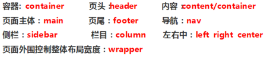
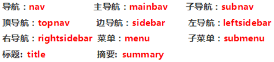
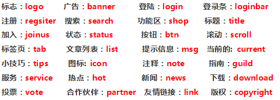

QuizzMe（Project of IWP）
===========================

这是IWP的大作业QuizzMe的全部代码

* layout.docx为各个页面的布局设计

* project.docx为任务需求

###页面结构

###导航

###功能

下面为任务原文：

##Subject 2: QuizzMe

QuizzMe is an application to  do Multiple Choice Question quizzes online in various topics. User can test their knowledge by making quizzes but it can also supply new questions and store them in the database.

###Expected features
* It should be possible to use the application without authentication. In this case, the user can make quizzes and get the score, but there is no way to store any information on the server.
* Conversely, a user can create an account on the web site. After authentication, she/he can perform quizzes and record the scores, and then display them at any time. An authenticated user can also add new questions to t he database of questions.
*The quizzes can be randomly generated from one or more files of questions. Each question consists of the question itself, possible responses, plus all (meta) information needed for managing it, including and not limited to:
    * indication of the correct answer
    * domain/theme (history, music, English, etc.)
    * difficulty level

###Additional Features

*the quizzes can be done with a time limit
*the quizzes are secure (i.e. the user cannot see the answers to the quizzes)

